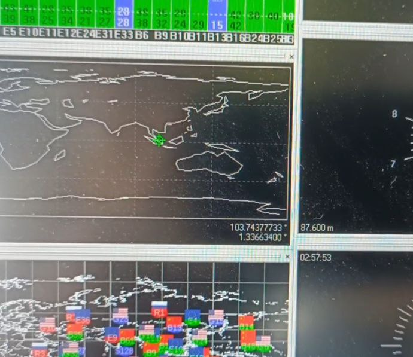

GNSS model:  
- simpleRTK2B series receiver (Basic Starter Kit)  
- Multi-band Active GNSS Antenna ANN-MB-00-00 (IP67)

Related links:  
- Hardware documentation: <https://www.ardusimple.com/how-to-use-ardusimple-rtk-receivers-and-get-gps-data-in-ros/>  
- ublox GPS driver: <https://github.com/KumarRobotics/ublox>

## Introduction
(What GNSS stands for and how it works)

## Setting up
We will be using ROS to handle the GNSS. Take note that the GNSS will most likely be unable to connect to your computer as it runs on a different version of WSL. Hence, it would be recommended to configure/run the GNSS on the Aruvii laptop. 

You can follow the hardware documentation link above as well as refer to the notes that I have taken down. You will not need to follow every step of the link above as some steps have already been configured.

> In any terminal opened, always source ~/catkin_ws/devel/setup.bash

1) In a terminal first source, then cd ~/catkin_ws/src/ublox/ublox_gps/launch  
2) Next launch the program with roslaunch ublox_gps ublox_device.launch param_file_name:=zed_f9p  
3) Open a new terminal and source  
	- rostopic echo /ublox/fix: to observe and monitor the GPS fix data being published (longitude , latitude, etc)  
	- rostopic echo /diagnostics: gives the information of the GPS status like accuracy amung others  
4) To record GPS fix data being published on “/ublox/fix” Topic, enter rostopic echo /ublox/fix > gps_fix_data.txt  
5) To record data about the GPS status “/diagnostics”, enter rostopic echo /diagnostics > gps_diagnostics.txt  
6) To see the info recorded in the files, enter nano gps_fix_data.txt or nano gps_diagnostics.txt  
7) For example, the “sensor_msgs/NavSatFix” is a message type in ROS that is used to represent GPS fix data like the latitude, longitude, altitude, and other parameters related to the GPS position.  To see the structure of “sensor_msgs/NavSatFix” message,  enter, rosmsg show sensor_msgs/NavSatFix.  
8) For example, to obtain the current logger configuration of the u-blox Node, which can be helpful for debugging and monitoring purposes, enter rosservice info /ublox/get_loggers  

Summary:  
1st terminal: roslaunch ublox_gps ublox_device.launch param_file_name:=zed_f9p  
	- launch program  
2nd terminal: rostopic echo /ublox/fix  
	- see the GPS data being published  

Another way to test the GNSS is to use the u-center software that should already be installed in the Aruvii laptop. You will be able to see the latitude and longtitude, which should correspond to your current location.

#### Notes
- If you want to follow the hardware documentation, under step 14, creating a COM11 port will not work. However, it should work if you use COM3 instead.  
- You should be testing the GNSS in an open-space environment, where the antenna has a direct view to the sky. You can go to a rooftop and try it out.