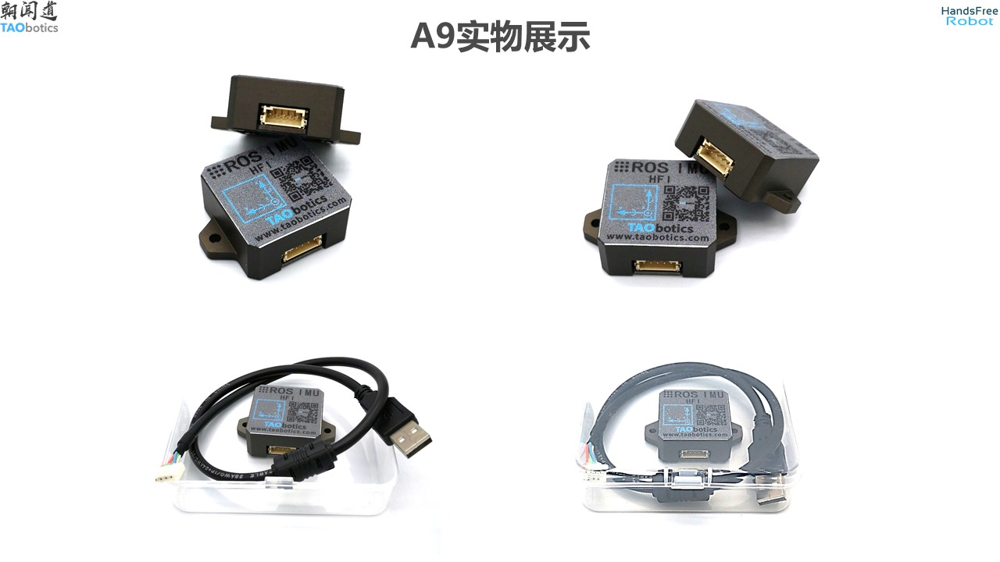

IMU model:  
- HFI-A9 Handsfree ROS IMU

- 
Related links:  
- Original hardware documentation/Drivers: <https://gitee.com/HANDS-FREE/handsfree_ros_imu/>  
- English translation/Tutorial: <https://docs.taobotics.com/docs/hfi-imu/hfi-imu-en/03_Basic_Tutorial/03_ROS_driver_and_visualization/doc.html>

## Introduction
(How imu works and why its purpose here)

## Setting up
Just like the GNSS, it would be recommended to set up the IMU with the Aruvii laptop.

Referring to the tutorial link above, it should be enough to get the IMU up and running.

> Check if the laptop is able to detect the USB being inserted. Enter ls /dev/ttyUSB* in the terminal, insert the USB and enter the same command again. 

## Tasks
- Start & receive data with IMU on the laptop
- Publish IMU Data to ROS as a ROS message (sensor_msgs/Imu or otherwise)
- Calculate heading/RPY from Magnetometer readings