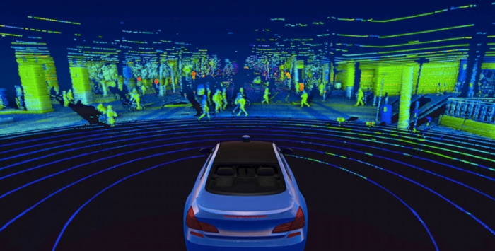

## LiDAR

This page will contain information that is useful to know before working on the project. You can treat it as prerequesite reading.

### CAUS sensors and solutions 

CAUS (Counter Unmanned Aircraft Systems) purpose is to prevent nefarious or unauthorised drones from disrupting places. Counter-drone solutions are to identify, track and mitigate threats, providing airspace security. 

##### Types of CAUS sensors:
- Radar
- RF (Radio Frequency) Analysers
- Accoustic
- Optical

Some CAUS technologies only use one type of sensor. Others can also opt to include a method of mitigation.

There are 4 methods to mitigate threats:
- Jamming
- Cyber-Takeover
- Kinetic
- High-Energy

### Point Cloud Simulation
A point cloud is a collection of data points plotted in a 3D environment.The LiDAR collects data and a software program takes that data to form a point cloud simulation.

### ROI - Region of Interest
Think of ROI as a specific portion of an image that is being focused on by the LiDAR. 