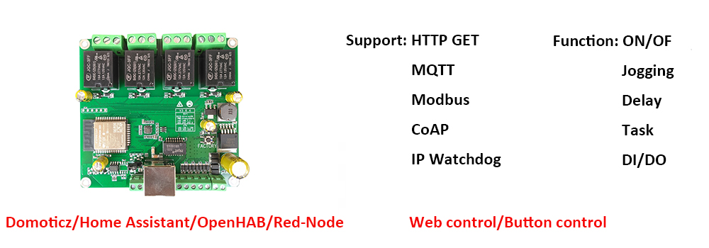

## Ethernet Relay Board

Board model: Dingtian 4-Channel Relay Board


Dingtian webpage link: <https://www.dingtian-tech.com/en_us/relay4.html>  
SDK download link: <http://www.dingtian-tech.com/sdk/relay_sdk.zip>

Before starting on the tasks below, download the SDK from the link above. This zipfile from the manufacterer provides all neccessary/related information to operate the relay board. 

### Task

Try to complete most of the tasks given here. You can choose to use any programming language you want as long as it works.  

1. Able to enable and disable individual relays  
2. Disable all relays in one command  
3. Get and show current status of all relays  
4. After 3 seconds with no commands, disable the relay automatically.  
5. Show current status every time a command is sent to a relay  
6. Add MQTT support: (optional)  
    - 2 topics per relay (enable/disable)  
    - One “disable all” topic  
    - One relay status topic  
7. User checking via json (optional)

An example snippet using Python:
```py
r = requests.get("http://192.168.7.1/relay_cgi.cgi?type=0&relay=0&on=1&time=0&pwd=0&")
```