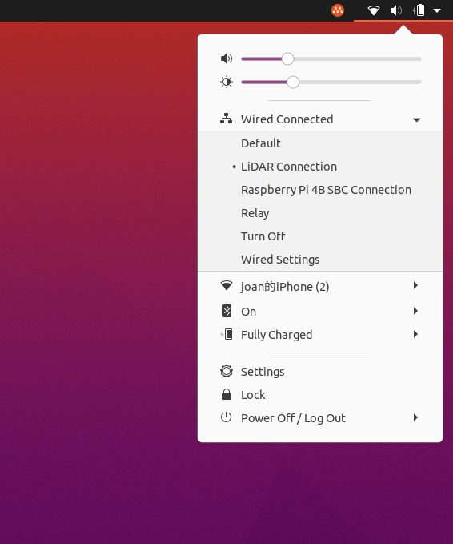
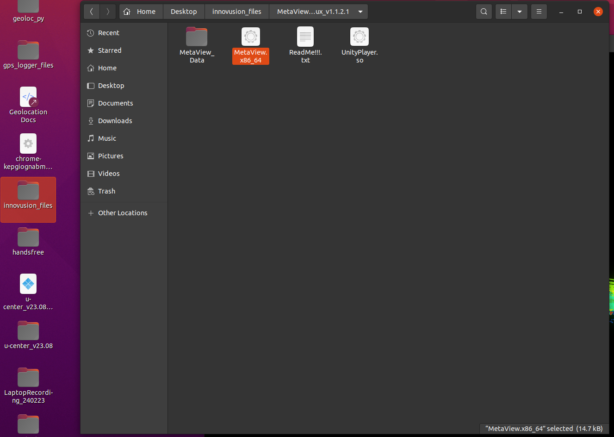
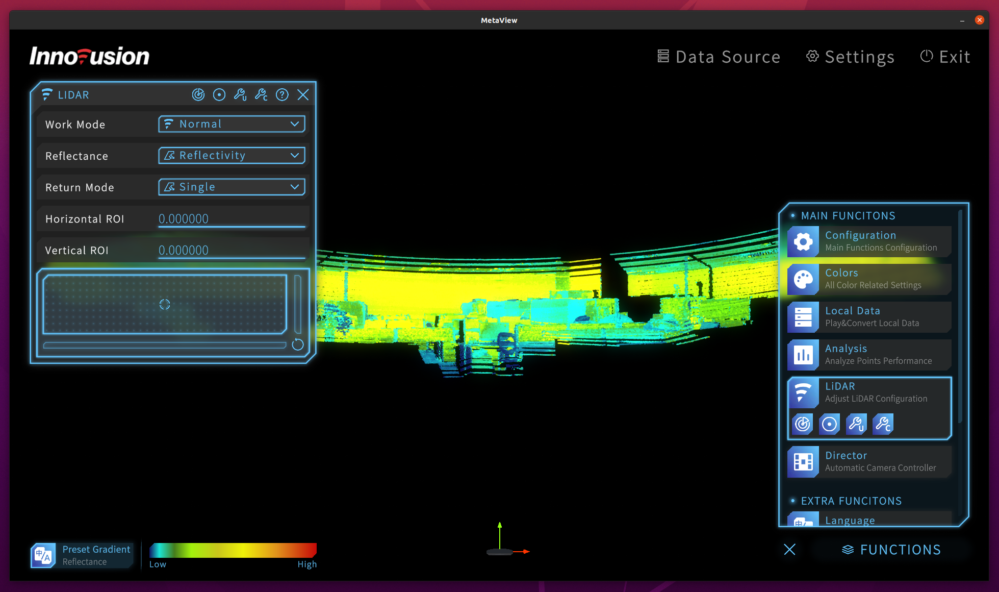

## Software
This page will be touching on how to setup the lidar as well as the programs used to operate the lidar. (Metaview & Ritz)

### Setup
- Take note that everytime you connect the lidar to the Aruvii laptop, you will have to switch the connection settings to LiDAR as the default selection is relay. The lidar will not show any output if not done so.

When connecting the wires, check the connectors of the wires as they are both different. At the end, you should see the arrows on the wire on the right and top respectively.
.jpg)
.jpg)

Lastly there should be one more connection to make.
.jpg)

Before running anything, **always** make sure to adjust the 'Wired Connections' settings on the Aruvii laptop as there will be no output if not done so. It will not switch to LiDAR by default, so you will have to change it everytime.


### Metaview
This is used to look at what the LiDAR can see as well as control the location of the [ROI](pre-read.md). 

There are 2 methods when it comes to configuring the ROI; one for controlling its particular position (centroid), the other for adjusting its parameters (kiv, waiting for update).

To launch Metaview, you can open up 'innovusion_files' folder on the desktop and find the .exe file 'Metaview.x86_64'. This launches the program directly, and you should see the lidar output without any issue.


Click on 'Functions' in the bottom right > 'LiDAR'. Drag the small circle in the box to move the ROI centroid. 


___

### Ritv
Ritv is a 3d simulation that produces the LiDAR output over your current location. With Ritv, you can see the detection and tracking of drones, as well as configure lidar parameters to refine the detection output (known as rqt_reconfigure).

To launch Ritv, first navigate to the 'aruvii_ws' folder on the desktop and open a terminal from there. There should be a 'instructions.txt' file with the commands you need to run in there. (If not, you can download the file at the bottom of the page)
```
roslaunch innovusion_pointcloud innovusion_points.launch
```

Launch a second terminal in aruvii_ws and run these commands. This should start Ritv.
```
source devel/setup.bash
roslaunch geolocation live.launch
```

Finally, in the third terminal, run this command to launch rqt_reconfigure parameters.
```
rosrun rqt_reconfigure rqt_reconfigure
```
___

#### Download
[instructions.txt](assets/instructions.txt){:download="instructions.txt"}  