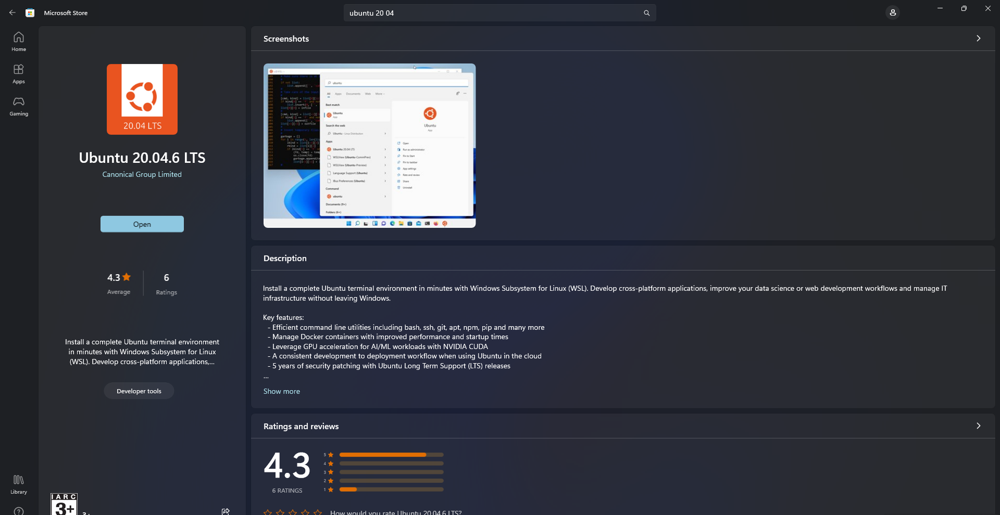
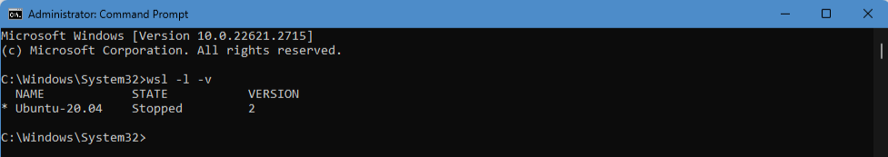

## ROS

In this page, you will be installing Windows Subsystem for Linux (WSL), Ubuntu and subsequently ROS.

Versions:  
- WSL 2  
- Ubuntu 20.04  
- ROS Noetic  

### WSL & Ubuntu
WSL allows you to install a Linux distribution, run applications and bash commands directly on your Windows PC without needing to use a virtual machine or run a dual-boot setup.

Reference link: <https://learn.microsoft.com/en-us/windows/wsl/install>

#### Additional notes:  

- You don't have to worry if WSL 1 will be installed since by default, WSL 2 will be installed. You can either directly install Ubuntu directly with the command line, or you can alternatively open your Microsoft Store, search for Ubuntu 20.04 and install.



- Remember your password for WSL user account as you might need it on the future.  

### ROS Noetic

Reference link: <https://wiki.ros.org/noetic/Installation/Ubuntu>

### Notes
Double-check that you have the correct versions installed, as there will be errors with commands otherwise.

- For WSL and Ubuntu, you can enter this command into the command prompt.
```
wsl -l -v
```
You should see something like this:


- For ROS, you can get your ROS distribution with this command in Ubuntu.
```
$ echo $ROS_DISTRO
```

- Additionally, always remember to source your environment in every new terminal you open in Ubuntu!
```
$ source /opt/ros/noetic/setup.bash
```
    - Some commands like rosbag or roscd might need an additional command to source before running.
    ```
    $ . ~/catkin_ws/devel/setup.bash
    ```

After finishing the installation & setup successfully, you can start on the [ROS tutorials](ros-tutorials.md). 